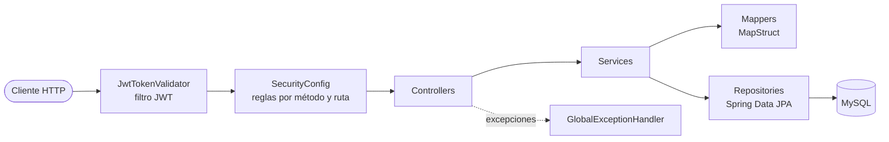
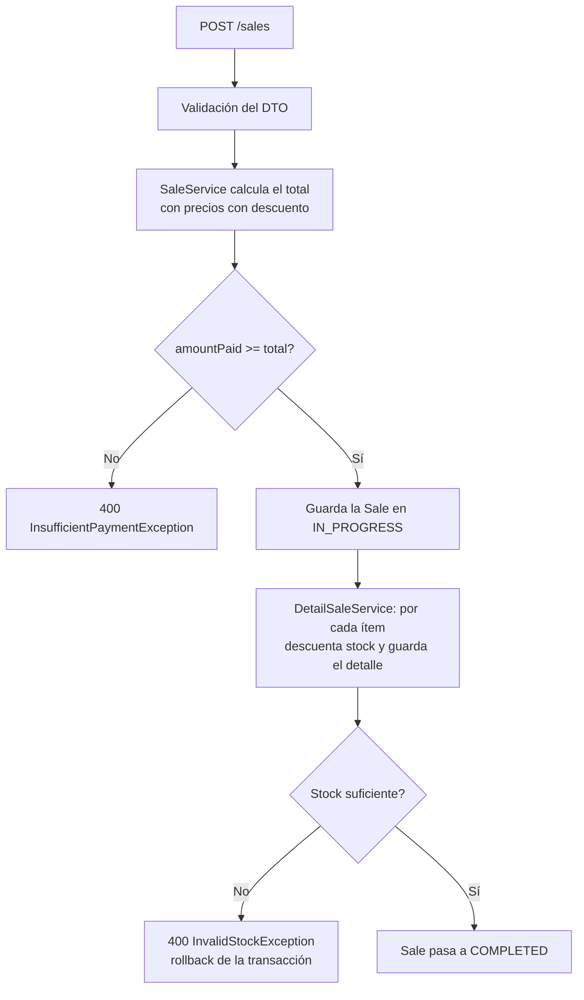
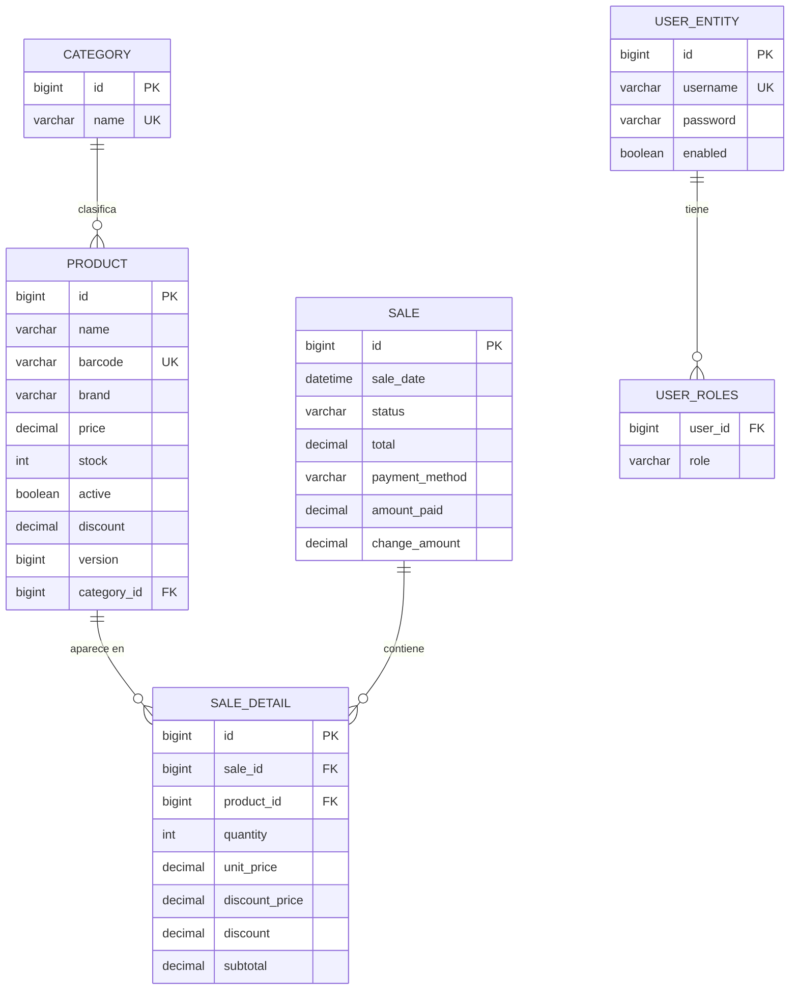

# StockFlow

API REST backend para un sistema de **punto de venta (POS) y gestión de inventario**, desarrollada con Java 17 y Spring Boot. Permite administrar productos y categorías, registrar ventas con descuento automático de stock, y generar comprobantes de venta en PDF. La autenticación usa JWT con dos roles (`ADMIN` y `USER`).

> Proyecto de portfolio, solo backend. No incluye interfaz de usuario.

---

## 📑 Tabla de contenidos

- [Descripción](#-descripción)
- [Funcionalidades](#-funcionalidades)
- [Arquitectura](#️-arquitectura)
- [Tecnologías utilizadas](#️-tecnologías-utilizadas)
- [Seguridad](#-seguridad)
- [Base de datos](#️-base-de-datos)
- [API REST](#-api-rest)
- [Ejemplos de requests](#-ejemplos-de-requests)
- [Generación de PDF](#-generación-de-pdf)
- [Manejo de errores](#️-manejo-de-errores)
- [Docker](#-docker)
- [Ejecución local sin Docker](#-ejecución-local-sin-docker)
- [Configuración](#️-configuración)
- [Estructura del proyecto](#-estructura-del-proyecto)
- [Instalación](#-instalación)
- [Documentación de API (Swagger)](#-documentación-de-api-swagger)
- [Testing](#-testing)
- [Consideraciones importantes](#-consideraciones-importantes)
- [Roadmap](#️-roadmap)
- [Autor](#-autor)
- [Licencia](#-licencia)

---

## 📋 Descripción

**StockFlow** resuelve la parte de servidor de un punto de venta pequeño: mantener un catálogo de productos con stock y descuentos, registrar ventas calculando total y vuelto, y emitir un comprobante imprimible de cada venta.

- **Tipo de sistema:** API REST stateless (Spring Boot) con persistencia en MySQL.
- **Funcionalidades principales:** gestión de productos y categorías, búsquedas paginadas, control de stock, descuentos por producto/marca/categoría, registro y cancelación de ventas, comprobante PDF, autenticación JWT con roles.
- **Tipo de negocio donde podría usarse:** comercios minoristas (kioscos, almacenes, tiendas) que necesiten registrar ventas y controlar inventario. Es un proyecto de aprendizaje: no implementa facturación fiscal ni integración con medios de pago reales.
- **Alcance del desarrollo:** todo el backend: modelo de datos, lógica de negocio, seguridad con Spring Security + JWT, manejo centralizado de errores, generación de PDF y contenedorización con Docker Compose.

---

## ✨ Funcionalidades

Todo lo listado a continuación está implementado en el código.

### Gestión de productos
- Crear productos asociados a una categoría existente (nombre, código de barras único, marca, precio, stock, estado activo y descuento).
- Consultar un producto por ID o por código de barras.
- Listar productos activos con paginación (10 por página).
- Buscar productos activos por nombre (contiene, sin distinguir mayúsculas), por marca (contiene, sin distinguir mayúsculas) y por categoría.
- Listar productos con stock bajo (stock menor o igual a un umbral configurable por query param, 10 por defecto).
- Actualizar los datos de un producto.
- Sumar stock a un producto (la cantidad debe ser mayor a 0).
- Aplicar descuento porcentual (0–100) a un producto, a todos los productos activos de una marca o de una categoría.
- Cálculo del precio con descuento, expuesto en las respuestas (`discountedPrice`).
- Las consultas solo devuelven productos con `active = true`.
- Desactivar un producto cuando su stock es 0 o menor (endpoint `updateStatus`, ver [limitaciones](#limitaciones-conocidas)).
- Control de concurrencia optimista sobre el producto (`@Version`): dos operaciones simultáneas sobre el mismo producto pueden resultar en un `409`.

### Gestión de categorías
- Crear, consultar por ID, listar (paginado), editar y eliminar categorías.
- El nombre de la categoría es único.

### Gestión de ventas
- Registrar una venta con uno o más ítems, método de pago (`CASH`, `CARD`, `TRANSFER`, `QR`) y monto pagado.
- Cálculo automático del total usando el precio con descuento vigente de cada producto, y del vuelto (`amountPaid - total`).
- Descuento automático de stock por cada ítem; si no hay stock suficiente, la operación se revierte (la creación de la venta es transaccional).
- Cada ítem guarda una copia del precio unitario, descuento, precio con descuento y subtotal al momento de la venta.
- Consultar una venta por ID y listar ventas (paginado, 10 por página).
- Cambiar el estado de una venta (`IN_PROGRESS`, `COMPLETED`, `CANCELED`). Al cancelar, el stock de los ítems se devuelve.
- Una venta cancelada no puede cambiar a otro estado.

### Autenticación y autorización
- Registro público de usuarios (siempre con rol `USER`).
- Login con usuario y contraseña que devuelve un JWT (HS256, vigencia de 6 horas).
- Contraseñas almacenadas con BCrypt.
- Autorización por rol (`USER` / `ADMIN`) y método HTTP, definida en `SecurityConfig`.
- Creación automática de un usuario `ADMIN` al iniciar la aplicación, a partir de variables de entorno.

### Generación de PDFs
- Comprobante no fiscal de venta en PDF, generado con iText (ver [Generación de PDF](#-generación-de-pdf)).

### Otras funcionalidades
- Validación de requests con Bean Validation.
- Manejo centralizado de errores con `@RestControllerAdvice` y un formato de error común.
- Mapeo entidad ↔ DTO con MapStruct.
- Documentación interactiva con Swagger UI (springdoc, configuración por defecto).
- Ejecución con Docker Compose (backend + MySQL con volumen persistente y healthcheck).

---

## 🏗️ Arquitectura

El proyecto sigue una **arquitectura en capas** típica de Spring Boot (Controller → Service → Repository), con DTOs para entrada/salida y MapStruct para las conversiones.



| Capa | Paquete | Responsabilidad |
|---|---|---|
| Controllers | `controllers` | Exponen los endpoints REST, validan el body con `@Valid` y delegan en los services. Definen la paginación (tamaño fijo de 10). |
| Services | `services` | Lógica de negocio: cálculo de descuentos, control de stock, creación y cancelación de ventas, registro/login, generación del PDF. Manejan las transacciones (`@Transactional`). |
| Repositories | `repositories` | Interfaces Spring Data JPA con consultas derivadas (por ejemplo `findByNameContainingIgnoreCaseAndActiveTrue`). |
| Entities | `entities` | Modelos JPA y enums (`Role`, `SaleStatus`, `PaymentMethod`). En este paquete también están `ErrorResponse` y `AuthLoginRequestDTO`. |
| DTOs | `dto/request`, `dto/response` | Objetos de entrada (con validaciones) y de salida. |
| Mappers | `mapper` | Interfaces MapStruct (`componentModel = "spring"`) entre entidades y DTOs. |
| Exceptions | `exceptions` | Excepciones de negocio y `GlobalExceptionHandler`. |
| Configuration | `configuration` | `SecurityConfig`, `UserDetail` (carga de usuarios para Spring Security), `DataInitializer` (usuario admin inicial) y el filtro `JwtTokenValidator`. |
| Utils | `utils` | `JwtUtils`: creación y verificación de tokens. |

**Flujo de creación de una venta:**



---

## 🛠️ Tecnologías utilizadas

| Tecnología | Uso |
|---|---|
| Java 17 | Lenguaje del proyecto |
| Spring Boot 3.4.1 | Framework base |
| Spring Web | API REST |
| Spring Data JPA / Hibernate | Persistencia y consultas |
| Spring Security | Autenticación, autorización por rol y configuración stateless |
| java-jwt (Auth0) 4.5.1 | Creación y verificación de JWT (HS256) |
| Bean Validation | Validación de DTOs de entrada |
| MySQL 8 | Base de datos relacional (imagen `mysql:8.0` en Docker) |
| MapStruct 1.6.3 | Mapeo entre entidades y DTOs |
| Lombok | Reducción de código repetitivo (getters, setters, constructores) |
| iText 7 (`itext7-core` 9.2.0) | Generación de comprobantes PDF |
| springdoc-openapi 2.8.3 | Swagger UI / OpenAPI |
| Maven (con Maven Wrapper) | Build y gestión de dependencias |
| Docker y Docker Compose | Contenedorización del backend y la base de datos |
| JUnit 5 y Mockito | Tests (cobertura mínima, ver [Testing](#-testing)) |

---

## 🔐 Seguridad

La seguridad se configura en `SecurityConfig` y funciona así:

- **Autenticación:** `POST /auth/login` valida usuario y contraseña con el `AuthenticationManager` (usuarios cargados desde la base de datos por `UserDetail`) y devuelve un JWT.
- **JWT:** firmado con HMAC256 usando `JWT_SECRET_KEY`. Incluye como claims el emisor (`JWT_USER_GENERATOR`), el usuario (`subject`), los roles (claim `roles`, con formato `ROLE_ADMIN` / `ROLE_USER`), fecha de emisión, expiración a las **6 horas** y un `jti` aleatorio.
- **`JwtTokenValidator`:** filtro (`OncePerRequestFilter`) registrado antes de `BasicAuthenticationFilter`. Si la request trae el header `Authorization`, extrae el token (descarta los primeros 7 caracteres, es decir `Bearer `), lo verifica (firma y emisor) y carga la autenticación con los roles del token en el `SecurityContext`.
- **Roles:** `ADMIN` y `USER` (enum `Role`). Los usuarios registrados desde `/auth/register` reciben `USER`; el administrador inicial lo crea `DataInitializer`.
- **Contraseñas:** codificadas con `BCryptPasswordEncoder`.
- **Sesiones:** `STATELESS`, no se usa sesión HTTP ni cookies de sesión.
- **CSRF:** deshabilitado (API stateless con token en header).
- **CORS:** configurado para permitir cualquier origen, método y header (`*`).
- **Autorización:** reglas por método HTTP y ruta; cualquier ruta no listada requiere estar autenticado (`anyRequest().authenticated()`). `@EnableMethodSecurity` está activo pero no se usan anotaciones como `@PreAuthorize`.

Para llamar a endpoints protegidos hay que enviar:

```
Authorization: Bearer <token>
```

### Matriz de acceso (según `SecurityConfig`)

| Método | Endpoint | Acceso |
|---|---|---|
| GET | `/v3/api-docs/**`, `/swagger-ui/**`, `/swagger-ui.html` | Público |
| GET | `/auth/**` | Público (no hay endpoints GET en `/auth`) |
| POST | `/auth/**` (`/auth/login`, `/auth/register`) | Público |
| PUT / PATCH / DELETE | `/auth/**` | ADMIN (no hay endpoints definidos con estos métodos) |
| GET | `/products/**` | Público |
| POST | `/products/**` | ADMIN |
| PUT | `/products/**` | ADMIN |
| PATCH | `/products/**` | ADMIN |
| DELETE | `/products/**` | ADMIN (no hay endpoint DELETE definido) |
| GET | `/categories/**` | USER o ADMIN |
| POST | `/categories/**` | ADMIN |
| PUT | `/categories/**` | ADMIN |
| PATCH | `/categories/**` | ADMIN (no hay endpoint PATCH definido) |
| DELETE | `/categories/**` | ADMIN |
| POST | `/sales/**` | USER o ADMIN |
| GET | `/sales/**` | ADMIN |
| PATCH | `/sales/**` | ADMIN |
| PUT / DELETE | `/sales/**` | ADMIN (no hay endpoints definidos con estos métodos) |
| GET | `/pdf/**` | ADMIN |
| Cualquier otra | — | Usuario autenticado |

---

## 🗄️ Base de datos

La base de datos es MySQL. El esquema lo genera Hibernate al iniciar (`spring.jpa.hibernate.ddl-auto=update`); no hay scripts SQL ni migraciones en el repositorio.

### Entidades

| Entidad | Campos relevantes | Notas |
|---|---|---|
| `Category` | `id` (PK, autoincremental), `name` | `name` único y obligatorio. |
| `Product` | `id` (PK), `name`, `barcode`, `brand`, `price`, `stock`, `active`, `discount`, `version`, `category_id` (FK) | `barcode` único. `discount` con `precision=5, scale=2` y rango 0–100. `version` (`@Version`) habilita bloqueo optimista. `category_id` no está marcado como obligatorio a nivel de columna. |
| `Sale` | `id` (PK), `sale_date`, `status`, `total`, `payment_method`, `amount_paid`, `change_amount` | `status` y `payment_method` se guardan como texto (`EnumType.STRING`). |
| `DetailSale` (tabla `sale_detail`) | `id` (PK), `sale_id` (FK), `product_id` (FK), `quantity`, `unit_price`, `discount_price`, `discount`, `subtotal` | `sale_id` y `product_id` obligatorios. Guarda una copia de precios y descuento al momento de la venta. |
| `UserEntity` | `id` (PK), `username`, `password`, flags de cuenta (`enabled`, `accountNonExpired`, `accountNonLocked`, `credentialsNonExpired`), roles | `username` único. Los roles se guardan en la tabla auxiliar `user_roles` (`@ElementCollection`, columna de unión `user_id`). |

### Enumeraciones

| Enum | Valores |
|---|---|
| `Role` | `ADMIN`, `USER` |
| `SaleStatus` | `COMPLETED`, `IN_PROGRESS`, `CANCELED` |
| `PaymentMethod` | `CASH`, `CARD`, `TRANSFER`, `QR` |

### Diagrama entidad-relación



> Las ventas **no** están asociadas a un usuario: `Sale` no tiene relación con `UserEntity`.

---

## 📡 API REST

URL base local: `http://localhost:8080`. Los endpoints que devuelven listas usan paginación de Spring Data: la respuesta es un objeto `Page` (`content`, `totalElements`, `totalPages`, `number`, `size`, etc.) con **10 elementos por página**.

### Authentication

| Método | URL | Auth | Descripción | Body | Respuesta |
|---|---|---|---|---|---|
| POST | `/auth/register` | No | Registra un usuario con rol `USER`. | `UserEntityRequestDTO` | `201` con el texto `REGISTERED`. `400` si el usuario ya existe o la validación falla. |
| POST | `/auth/login` | No | Autentica y devuelve el JWT. | `AuthLoginRequestDTO` | `200` con el token como **texto plano** (no JSON). `401` si las credenciales son inválidas. |

### Products

| Método | URL | Rol | Descripción | Parámetros | Respuesta |
|---|---|---|---|---|---|
| GET | `/products` | Público | Lista productos activos. | Query `pageNumber` (def. `0`; si es negativo se usa `0`) | `200` `Page<ProductResponseDto>` |
| GET | `/products/{id}` | Público | Producto activo por ID. | Path `id` | `200` `ProductResponseDto`; `404` |
| GET | `/products/barcode/{barcode}` | Público | Producto activo por código de barras. | Path `barcode` | `200`; `404` |
| GET | `/products/name/{name}` | Público | Búsqueda por nombre (contiene, sin distinguir mayúsculas). | Path `name`; query **`pagenumber`** (en minúsculas, def. `0`) | `200` `Page` |
| GET | `/products/brand/{brand}` | Público | Búsqueda por marca (contiene, sin distinguir mayúsculas). | Path `brand`; query `pageNumber` | `200` `Page` |
| GET | `/products/category/{categoryId}` | Público | Productos activos de una categoría. | Path `categoryId`; query `pageNumber` | `200` `Page` |
| GET | `/products/low-stock` | Público | Productos con stock menor o igual al umbral. | Query `stock` (def. `10`), `pageNumber` | `200` `Page` |
| POST | `/products` | ADMIN | Crea un producto. | Body `ProductRequestDTO` | `201` `CREATED SUCCESSFULL`; `400` validación; `404` categoría inexistente |
| PUT | `/products/update/{productID}` | ADMIN | Actualiza nombre, código de barras, marca, precio, stock, categoría y descuento. | Path `productID`; body `ProductRequestDTO` | `200` `Updated product`; `404` |
| PATCH | `/products/stock/{id}/{quantity}` | ADMIN | Suma `quantity` al stock. | Path `id`, `quantity` (debe ser > 0) | `200` `Updated stock`; `400` cantidad inválida; `404` |
| PATCH | `/products/discount/{productId}` | ADMIN | Aplica descuento a un producto. | Path `productId`; query `discount` (0–100) | `200`; `400` descuento inválido; `404` |
| PATCH | `/products/discount/brand/{brand}` | ADMIN | Aplica descuento a los productos activos de una marca (coincidencia exacta, sin distinguir mayúsculas). | Path `brand`; query `discount` | `200`; `400`; `404` si no hay productos |
| PATCH | `/products/discount/category/{categoryId}` | ADMIN | Aplica descuento a los productos activos de una categoría. | Path `categoryId`; query `discount` | `200`; `400`; `404` si no hay productos |
| PATCH | `/products/updateStatus/{productID}` | ADMIN | Pone `active = false` si el stock es ≤ 0 (si no, lo deja activo). Solo opera sobre productos activos. | Path `productID` | `200` `Updated status`; `404` |

`ProductResponseDto`: `id`, `name`, `barcode`, `brand`, `price`, `discountedPrice`, `discount`, `stock`, `active`, `categoryName`.

### Categories

| Método | URL | Rol | Descripción | Parámetros | Respuesta |
|---|---|---|---|---|---|
| GET | `/categories` | USER / ADMIN | Lista categorías. | Query `pageNumber` (def. `0`) | `200` `Page<CategoryResponseDto>` |
| GET | `/categories/{id}` | USER / ADMIN | Categoría por ID. | Path `id` | `200` `CategoryResponseDto` (`id`, `name`); `404` |
| POST | `/categories` | ADMIN | Crea una categoría. | Body `CategoryRequestDTO` | `201` `COMPLETED`; `400` |
| PUT | `/categories/{id}` | ADMIN | Edita el nombre. | Path `id`; body `CategoryRequestDTO` | `200` `CATEGORY EDITED`; `404` |
| DELETE | `/categories/{id}` | ADMIN | Elimina la categoría. | Path `id` | `200` `CATEGORY DELETED`; `404` |

### Sales

| Método | URL | Rol | Descripción | Parámetros | Respuesta |
|---|---|---|---|---|---|
| POST | `/sales` | USER / ADMIN | Registra una venta y descuenta stock. | Body `SaleRequestDTO` | `201` `Sale created successfully` (no devuelve el ID). `400` pago insuficiente, stock insuficiente o validación; `404` producto inexistente o inactivo; `409` modificación concurrente |
| GET | `/sales` | ADMIN | Lista ventas. | Query `pageNumber` (def. `0`) | `200` `Page<SaleResponseDto>` |
| GET | `/sales/{saleID}` | ADMIN | Venta por ID. | Path `saleID` | `200` `SaleResponseDto`; `404` |
| PATCH | `/sales/{saleID}/status/{status}` | ADMIN | Cambia el estado (`IN_PROGRESS`, `COMPLETED` o `CANCELED`, sin distinguir mayúsculas). Al cancelar devuelve el stock. | Path `saleID`, `status` | `200`; `404` venta inexistente; `409` venta ya cancelada o estado inválido |

`SaleResponseDto`: `id`, `saleDate`, `status`, `total`, `paymentMethod`, `amountPaid`, `changeAmount`. **No incluye el detalle de ítems.**

### PDF

| Método | URL | Rol | Descripción | Respuesta |
|---|---|---|---|---|
| GET | `/pdf/{saleID}` | ADMIN | Genera el comprobante PDF de una venta. | `200` `application/pdf` (descarga `archivo.pdf`); `404` si la venta no existe |

---

## 📦 Ejemplos de requests

Los nombres de campos corresponden a los DTOs del proyecto. Los valores son de ejemplo.

**Registro** — `POST /auth/register` (`username` mín. 3 caracteres, `password` mín. 8)

```json
{
  "username": "cajero1",
  "password": "password123"
}
```

**Login** — `POST /auth/login`

```json
{
  "username": "your_username",
  "password": "your_password"
}
```

La respuesta es el token en texto plano. Usarlo en el header `Authorization: Bearer <token>`.

**Crear categoría** — `POST /categories`

```json
{
  "name": "Bebidas"
}
```

**Crear producto** — `POST /products` (todos los campos salvo `brand` son obligatorios; `discount` entre 0 y 100)

```json
{
  "name": "Coca-Cola 1.5L",
  "barcode": "123456789",
  "brand": "Coca Cola",
  "price": 5000,
  "stock": 20,
  "active": true,
  "discount": 0,
  "categoryId": 1
}
```

**Actualizar producto** — `PUT /products/update/1` (mismo DTO; el campo `active` es obligatorio en la validación pero este endpoint no lo modifica)

```json
{
  "name": "Coca-Cola 1.5L",
  "barcode": "123456789",
  "brand": "Coca Cola",
  "price": 5500,
  "stock": 25,
  "active": true,
  "discount": 10,
  "categoryId": 1
}
```

**Aplicar descuento** — sin body, el porcentaje va como query param

```
PATCH /products/discount/1?discount=15
PATCH /products/discount/brand/Coca Cola?discount=10
PATCH /products/discount/category/1?discount=5
```

**Sumar stock** — sin body

```
PATCH /products/stock/1/20
```

**Crear venta** — `POST /sales` (`amountPaid` debe ser ≥ 1 y cubrir el total)

```json
{
  "paymentMethod": "CASH",
  "amountPaid": 10000,
  "detailSaleRequestDTOList": [
    {
      "productId": 1,
      "quantity": 2
    }
  ]
}
```

**Cancelar una venta** — sin body

```
PATCH /sales/1/status/CANCELED
```

**Ejemplo de respuesta de producto** — `GET /products/1`

```json
{
  "id": 1,
  "name": "Coca-Cola 1.5L",
  "barcode": "123456789",
  "brand": "Coca Cola",
  "price": 5000,
  "discountedPrice": 4250.00,
  "discount": 15,
  "stock": 20,
  "active": true,
  "categoryName": "Bebidas"
}
```

### Flujo rápido con curl

```bash
# 1. Login (la respuesta es el token en texto plano)
TOKEN=$(curl -s -X POST http://localhost:8080/auth/login \
  -H "Content-Type: application/json" \
  -d '{"username":"your_admin_username","password":"your_admin_password"}')

# 2. Crear categoría y producto
curl -X POST http://localhost:8080/categories \
  -H "Authorization: Bearer $TOKEN" -H "Content-Type: application/json" \
  -d '{"name":"Bebidas"}'

curl -X POST http://localhost:8080/products \
  -H "Authorization: Bearer $TOKEN" -H "Content-Type: application/json" \
  -d '{"name":"Coca-Cola 1.5L","barcode":"123456789","brand":"Coca Cola","price":5000,"stock":20,"active":true,"discount":0,"categoryId":1}'

# 3. Registrar una venta
curl -X POST http://localhost:8080/sales \
  -H "Authorization: Bearer $TOKEN" -H "Content-Type: application/json" \
  -d '{"paymentMethod":"CASH","amountPaid":10000,"detailSaleRequestDTOList":[{"productId":1,"quantity":2}]}'

# 4. Descargar el comprobante (el ID se obtiene de GET /sales)
curl -H "Authorization: Bearer $TOKEN" http://localhost:8080/pdf/1 -o comprobante.pdf
```

---

## 📄 Generación de PDF

- **Endpoint:** `GET /pdf/{saleID}` — solo `ADMIN`.
- **Librería:** iText 7 (`itext7-core`), con fuente estándar Helvetica.
- **Funcionamiento:** `PdfService` busca la venta y sus ítems en la base de datos, arma el documento en memoria y lo devuelve como `byte[]` con `Content-Type: application/pdf` y `Content-Disposition: attachment; filename=archivo.pdf`.
- **Contenido del comprobante** ("Comprobante no fiscal de venta"):
  - Encabezado con el nombre `STOCKFLOW`.
  - Datos de la operación: número de comprobante (`#` + ID con 6 dígitos), fecha y hora de la venta, estado y método de pago.
  - Detalle de artículos: producto, cantidad, precio unitario, descuento, precio final y subtotal.
  - Resumen: total de unidades, monto total, monto recibido y vuelto.
  - Pie con un mensaje fijo de agradecimiento y la fecha/hora de emisión.
- **Errores:** `404` si la venta no existe; `500` (`PdfGenerationException`) si falla la carga de fuentes.

---

## ⚠️ Manejo de errores

`GlobalExceptionHandler` (`@RestControllerAdvice`) convierte las excepciones en respuestas JSON con un formato único (`ErrorResponse`):

```json
{
  "message": "The requested product does not exist.",
  "status": 404,
  "timestamp": "2026-01-15T14:30:00.123456"
}
```

| Excepción | HTTP | Cuándo ocurre |
|---|---|---|
| `ProductNotFoundException` | 404 | Producto inexistente o inactivo; marca/categoría sin productos activos al aplicar descuento |
| `CategoryNotFoundException` | 404 | Categoría inexistente |
| `SaleNotFoundException` | 404 | Venta inexistente |
| `InsufficientPaymentException` | 400 | `amountPaid` menor al total de la venta |
| `InvalidStockException` | 400 | Stock insuficiente al vender, o cantidad ≤ 0 al sumar stock |
| `InvalidDiscountException` | 400 | Descuento fuera del rango 0–100 |
| `UserAlreadyExistsException` | 400 | Registro con un `username` existente |
| `MethodArgumentNotValidException` | 400 | Falla de validación del body (el mensaje lista `campo: detalle`) |
| `InvalidSaleStatusException` | 409 | Cambiar el estado de una venta ya cancelada, o enviar un estado inválido |
| `OptimisticLockingFailureException` | 409 | Un producto fue modificado simultáneamente por otra operación |
| `BadCredentialsException` | 401 | Login con credenciales inválidas |
| `AccessDeniedException` | 403 | Handler definido (ver nota en limitaciones) |
| `PdfGenerationException` | 500 | Error al generar el PDF |
| `Exception` (genérico) | 500 | Cualquier excepción sin handler específico |

---

## 🐳 Docker

El repositorio incluye un `Dockerfile` y un `docker-compose.yml` que levantan el backend y MySQL.

### 1. Requisitos
- Docker y Docker Compose.
- Java 17 (el `Dockerfile` copia un `.jar` ya compilado, por lo que hay que generarlo antes con Maven; el Maven Wrapper `mvnw` ya está en el repo).

### 2. Variables de entorno y archivo `.env`
Docker Compose lee un archivo `.env` en la raíz del proyecto (está en `.gitignore`; **el repositorio no incluye un `.env.example`**, hay que crearlo). Contenido sugerido, con placeholders:

```env
SPRING_DATASOURCE_URL=jdbc:mysql://db:3306/stockflow
SPRING_DATASOURCE_USERNAME=stockflow_user
SPRING_DATASOURCE_PASSWORD=your_password
SPRING_DATASOURCE_DB=stockflow

JWT_SECRET_KEY=your_secret
JWT_USER_GENERATOR=your_issuer_name

ADMIN_USERNAME=your_admin_username
ADMIN_PASSWORD=your_admin_password
```

> Importante: el compose crea el usuario de MySQL con el nombre fijo `stockflow_user`, y usa `SPRING_DATASOURCE_PASSWORD` tanto para ese usuario como para el usuario `root`. Por eso `SPRING_DATASOURCE_USERNAME` debe ser `stockflow_user` (o `root`), y el nombre de la base en la URL debe coincidir con `SPRING_DATASOURCE_DB`.

### 3. Servicios de Docker Compose

| Servicio | Imagen / build | Puertos (host:contenedor) | Detalles |
|---|---|---|---|
| `db` | `mysql:8.0` | `3307:3306` | Contenedor `stockflow_db`. Volumen nombrado `db_data` montado en `/var/lib/mysql`. `restart: always`. |
| `backend` | `build: .` (también declara la imagen `lucascabj4710/stockflow-backend:latest`) | `8080:8080` | Contenedor `stockflow_backend`. Recibe las variables de entorno del `.env`. Espera a que `db` esté saludable (`depends_on: condition: service_healthy`). `restart: always`. |

- **Healthcheck de MySQL:** `mysqladmin ping -h localhost` cada 5 s, timeout de 5 s, hasta 10 reintentos.
- **Imagen del backend:** `eclipse-temurin:17-jdk-alpine`, copia `target/stockflow-backend-0.0.1-SNAPSHOT.jar` y lo ejecuta con `java -jar`.
- **Volumen:** los datos de MySQL persisten en `db_data` aunque se detengan o recreen los contenedores.

### 4. Puertos: `localhost:3307` vs `db:3306`
- **`localhost:3307`** (o `127.0.0.1:3307`): es el puerto de MySQL **visto desde tu máquina** (cliente SQL, IntelliJ, etc.).
- **`db:3306`**: es la dirección de MySQL **vista desde el contenedor del backend**, dentro de la red de Docker Compose (`db` es el nombre del servicio). Por eso la URL del `.env` para Docker usa `db:3306`.

### 5. Construir, iniciar, detener y reconstruir

```bash
# Construir el .jar (necesario antes de construir la imagen)
./mvnw clean package -DskipTests

# Construir la imagen e iniciar en segundo plano
docker compose up -d --build

# Ver logs del backend
docker compose logs -f backend

# Detener (conserva los datos de la base)
docker compose down

# Detener y BORRAR los datos de la base (elimina el volumen)
docker compose down -v

# Reconstruir después de cambiar código
./mvnw clean package -DskipTests
docker compose up -d --build
```

En Windows (PowerShell/CMD) usar `mvnw.cmd` en lugar de `./mvnw`.

Con los contenedores arriba, la API queda en `http://localhost:8080`.

---

## 💻 Ejecución local sin Docker

**Requisitos:**
- Java 17.
- MySQL 8 con una base creada (Hibernate crea las tablas, pero no la base): `CREATE DATABASE stockflow;`
- Maven (o el Maven Wrapper incluido).

**Configuración:** `application.properties` toma todos los valores de variables de entorno, así que hay que definirlas antes de iniciar (ver [Configuración](#️-configuración)). Para la conexión a la base se pueden usar `DB_URL`, `DB_USERNAME` y `DB_PASSWORD` (los placeholders del archivo) o, alternativamente, `SPRING_DATASOURCE_URL`, `SPRING_DATASOURCE_USERNAME` y `SPRING_DATASOURCE_PASSWORD`.

**Desde IntelliJ:** abrir `StockflowBackendApplication`, ir a *Run → Edit Configurations → Environment variables* y cargar las variables.

**Desde la terminal (Linux/macOS):**

```bash
export DB_URL=jdbc:mysql://localhost:3306/stockflow
export DB_USERNAME=your_db_user
export DB_PASSWORD=your_password
export JWT_SECRET_KEY=your_secret
export JWT_USER_GENERATOR=your_issuer_name
export ADMIN_USERNAME=your_admin_username
export ADMIN_PASSWORD=your_admin_password

./mvnw spring-boot:run
```

**Desde PowerShell (Windows):**

```powershell
$env:DB_URL="jdbc:mysql://localhost:3306/stockflow"
$env:DB_USERNAME="your_db_user"
$env:DB_PASSWORD="your_password"
$env:JWT_SECRET_KEY="your_secret"
$env:JWT_USER_GENERATOR="your_issuer_name"
$env:ADMIN_USERNAME="your_admin_username"
$env:ADMIN_PASSWORD="your_admin_password"

.\mvnw.cmd spring-boot:run
```

> También se puede usar el MySQL del `docker-compose.yml` y ejecutar solo el backend localmente: levantar únicamente la base con `docker compose up -d db` y usar `jdbc:mysql://localhost:3307/stockflow` como URL.

---

## ⚙️ Configuración

Variables de entorno que usa el proyecto:

| Variable | Descripción | Ejemplo |
|---|---|---|
| `SPRING_DATASOURCE_URL` | URL JDBC de la base. Docker Compose la pasa al backend. | `jdbc:mysql://db:3306/stockflow` |
| `SPRING_DATASOURCE_USERNAME` | Usuario de la base. En Docker debe ser `stockflow_user` (o `root`). | `stockflow_user` |
| `SPRING_DATASOURCE_PASSWORD` | Contraseña de la base. En Docker Compose también define la contraseña de `root` y de `stockflow_user` en MySQL. | `your_password` |
| `SPRING_DATASOURCE_DB` | Solo para Docker Compose: nombre de la base que crea el contenedor MySQL. | `stockflow` |
| `DB_URL` | Alternativa para ejecución local: es el placeholder que usa `application.properties` para `spring.datasource.url`. | `jdbc:mysql://localhost:3306/stockflow` |
| `DB_USERNAME` | Placeholder de `spring.datasource.username`. | `your_db_user` |
| `DB_PASSWORD` | Placeholder de `spring.datasource.password`. | `your_password` |
| `JWT_SECRET_KEY` | Clave para firmar y verificar los JWT (HMAC256). | `your_secret` |
| `JWT_USER_GENERATOR` | Emisor (`issuer`) de los tokens; se exige el mismo valor al verificarlos. | `your_issuer_name` |
| `ADMIN_USERNAME` | Usuario del administrador inicial. | `your_admin_username` |
| `ADMIN_PASSWORD` | Contraseña del administrador inicial (se guarda con BCrypt). | `your_admin_password` |

> En Docker, las variables `SPRING_DATASOURCE_*` tienen prioridad sobre los placeholders `DB_*` de `application.properties`, por el mecanismo de configuración externa de Spring Boot.

Otras propiedades fijas de `application.properties`: `spring.jpa.hibernate.ddl-auto=update`, `spring.jpa.show-sql=true` y dialecto `MySQLDialect`.

---

## 📂 Estructura del proyecto

```
stockflow-backend/
├── .mvn/                                  # Maven Wrapper
├── src/
│   ├── main/
│   │   ├── java/com/stockflow_backend/
│   │   │   ├── StockflowBackendApplication.java
│   │   │   ├── configuration/
│   │   │   │   ├── filter/
│   │   │   │   │   └── JwtTokenValidator.java
│   │   │   │   ├── DataInitializer.java
│   │   │   │   ├── SecurityConfig.java
│   │   │   │   └── UserDetail.java
│   │   │   ├── controllers/               # Auth, Category, Pdf, Product, Sale
│   │   │   ├── dto/
│   │   │   │   ├── request/
│   │   │   │   └── response/
│   │   │   ├── entities/                  # Entidades, enums, ErrorResponse, AuthLoginRequestDTO
│   │   │   ├── exceptions/                # Excepciones de negocio + GlobalExceptionHandler
│   │   │   ├── mapper/                    # Interfaces MapStruct
│   │   │   ├── repositories/
│   │   │   ├── services/                  # Auth, Category, DetailSale, Pdf, Product, Sale
│   │   │   └── utils/
│   │   │       └── JwtUtils.java
│   │   └── resources/
│   │       └── application.properties
│   └── test/
│       └── java/com/stockflow_backend/
│           ├── CategoryServiceTests.java
│           └── StockflowBackendApplicationTests.java
├── .gitattributes
├── .gitignore
├── docker-compose.yml
├── Dockerfile
├── mvnw
├── mvnw.cmd
├── pom.xml
└── README.md
```

---

## 🚀 Instalación

Guía desde cero con Docker:

```bash
# 1. Clonar el repositorio
git clone https://github.com/Lucascabj4710/stockflow-backend.git
cd stockflow-backend

# 2. Crear el archivo .env en la raíz (ver sección Docker) con tus valores
#    SPRING_DATASOURCE_URL=jdbc:mysql://db:3306/stockflow
#    SPRING_DATASOURCE_USERNAME=stockflow_user
#    SPRING_DATASOURCE_PASSWORD=your_password
#    SPRING_DATASOURCE_DB=stockflow
#    JWT_SECRET_KEY=your_secret
#    JWT_USER_GENERATOR=your_issuer_name
#    ADMIN_USERNAME=your_admin_username
#    ADMIN_PASSWORD=your_admin_password

# 3. Generar el .jar (requiere Java 17)
./mvnw clean package -DskipTests

# 4. Construir e iniciar los contenedores
docker compose up -d --build

# 5. Verificar que el backend arrancó
docker compose logs -f backend
```

Después:
1. Abrir Swagger UI en `http://localhost:8080/swagger-ui/index.html`.
2. Hacer login con `ADMIN_USERNAME` / `ADMIN_PASSWORD` en `POST /auth/login` para obtener el token.
3. Usar el token en el header `Authorization: Bearer <token>`.

Para ejecutarlo sin Docker, ver [Ejecución local sin Docker](#-ejecución-local-sin-docker).

---

## 🔎 Documentación de API (Swagger)

El proyecto incluye `springdoc-openapi-starter-webmvc-ui` y las rutas están habilitadas públicamente en `SecurityConfig`:

| Recurso | URL |
|---|---|
| Swagger UI | `http://localhost:8080/swagger-ui/index.html` |
| OpenAPI (JSON) | `http://localhost:8080/v3/api-docs` |

La documentación es la que springdoc genera automáticamente a partir de los controllers. No hay anotaciones `@Operation` ni una configuración propia de OpenAPI, y **no se define un esquema de seguridad Bearer**, por lo que Swagger UI no ofrece botón *Authorize*: para probar endpoints protegidos conviene usar Postman, curl o similar con el header `Authorization`.

---

## 🧪 Testing

Los tests existentes son **mínimos** y no representan una cobertura real:

| Test | Qué hace |
|---|---|
| `CategoryServiceTests.createCategoryTest` | Test con Mockito sobre `CategoryService`. Actualmente solo verifica el resultado del mapper simulado; no invoca `createCategory` del service. |
| `StockflowBackendApplicationTests.contextLoads` | Test `@SpringBootTest` que verifica que el contexto de Spring levanta. Requiere las variables de entorno definidas y una base MySQL accesible. |

Ejecutar:

```bash
./mvnw test
```

No hay tests de controllers, seguridad, lógica de ventas, stock ni generación de PDF.

---

## 📌 Consideraciones importantes

- **Usuario ADMIN inicial:** al iniciar, `DataInitializer` crea el usuario con `ADMIN_USERNAME` y `ADMIN_PASSWORD` solo si ese username no existe. Si ya existe, no se modifica (ni su contraseña ni sus roles).
- **Registro público:** cualquier persona puede crear una cuenta `USER` vía `/auth/register`. Ese rol puede listar categorías y registrar ventas. No hay endpoint para crear otros administradores.
- **Persistencia en Docker:** los datos viven en el volumen `db_data`. `docker compose down` los conserva; `docker compose down -v` los elimina.
- **Esquema automático:** `ddl-auto=update` crea/actualiza tablas al iniciar; la base de datos en sí debe existir (en Docker la crea el contenedor).
- **Paginación:** tamaño fijo de 10 elementos. El parámetro es `pageNumber`, **excepto** en `/products/name/{name}`, donde se llama `pagenumber` (en minúsculas).
- **Productos inactivos:** las consultas y las ventas solo consideran productos con `active = true`.
- **Tokens:** duran 6 horas y no hay mecanismo de refresh ni de revocación.
- **Respuestas en texto plano:** varios endpoints (`/auth/login`, `/auth/register`, creación y edición de recursos) responden con un texto en lugar de un objeto JSON.
- **ID de la venta:** `POST /sales` no devuelve el ID de la venta creada; se obtiene listando con `GET /sales` (solo ADMIN).
- **`show-sql=true`:** las consultas SQL se imprimen en consola.

### Limitaciones conocidas

Descripción honesta del estado actual del código:

- **Errores del filtro JWT:** `JwtTokenValidator` no valida que el header comience con `Bearer ` (descarta los primeros 7 caracteres) y un token inválido o expirado lanza una excepción dentro del filtro, que no pasa por `GlobalExceptionHandler`. Del mismo modo, los rechazos por falta de permisos en rutas protegidas los resuelve Spring Security con su comportamiento por defecto (normalmente `403`, sin el JSON de `ErrorResponse`).
- **Errores no contemplados → 500:** excepciones sin handler específico caen en el handler genérico (`500`). Por ejemplo: código de barras o nombre de categoría duplicados (violación de unicidad), eliminar una categoría con productos asociados, o un `pageNumber` negativo en endpoints que no lo normalizan.
- **Ciclo de vida del producto:** `updateStatus` solo desactiva (no reactiva productos ya inactivos, porque busca únicamente productos activos), el `PUT` no modifica `active`, y aunque `ProductService` tiene un método `deleteProduct` (baja lógica), no hay endpoint que lo exponga.
- **Estados de venta:** pasar entre `IN_PROGRESS` y `COMPLETED` no modifica el stock; solo `CANCELED` lo devuelve. Al cancelar, la devolución de stock falla con `404` si alguno de los productos de la venta está inactivo.
- **Ventas sin usuario:** una venta no registra qué usuario la hizo ni incluye el detalle de ítems en `SaleResponseDto`.
- **CORS abierto** a cualquier origen y **tests mínimos** (ver [Testing](#-testing)).

---

## 🗺️ Roadmap

> **Todo lo de esta sección es NO IMPLEMENTADO.** Son mejoras posibles, no funcionalidades existentes.

- [ ] Tests unitarios y de integración (services, controllers, seguridad).
- [ ] Manejo explícito de errores del filtro JWT (token inválido/expirado) y de `DataIntegrityViolationException`.
- [ ] Endpoint para reactivar productos y/o exponer la baja lógica de productos.
- [ ] Incluir el detalle de ítems en la respuesta de ventas y devolver el ID al crear una venta.
- [ ] Asociar cada venta al usuario que la registró.
- [ ] Respuestas JSON consistentes en todos los endpoints.
- [ ] Configurar el esquema de seguridad Bearer en Swagger y documentar los endpoints con anotaciones OpenAPI.
- [ ] Archivo `.env.example` y CORS restringido por origen.
- [ ] Migraciones de base de datos (Flyway o Liquibase) en lugar de `ddl-auto=update`.
- [ ] Observabilidad (logging estructurado, Spring Boot Actuator).
- [ ] Integración continua (CI) para compilar y ejecutar tests.
- [ ] Caché (por ejemplo Redis) y mensajería (por ejemplo RabbitMQ), solo si el proyecto llega a necesitarlos.

---

## 👨‍💻 Autor

**Lucas Valenzuela**
GitHub: [@Lucascabj4710](https://github.com/Lucascabj4710)

---

## 📄 Licencia

El repositorio no incluye un archivo de licencia, por lo que actualmente **no se especifica ninguna licencia**.
